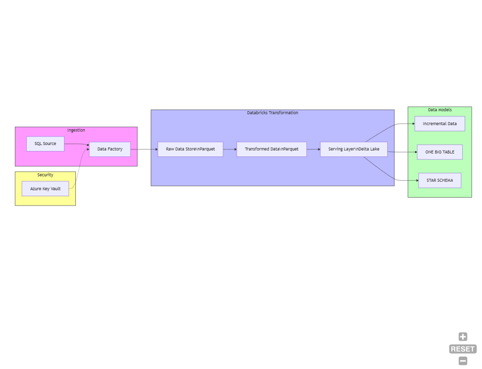
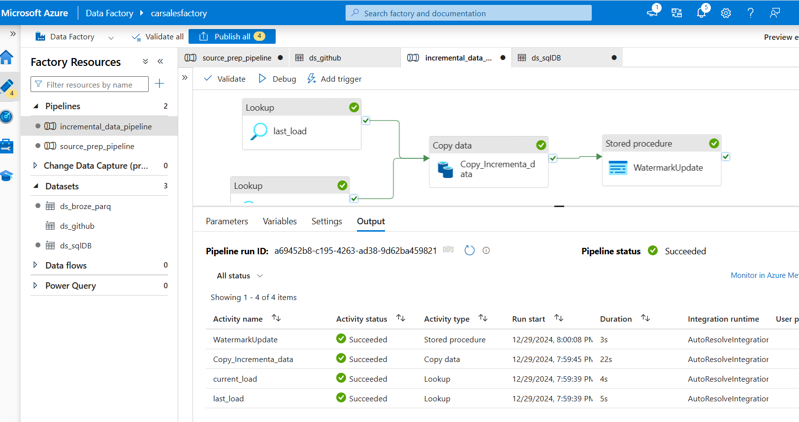
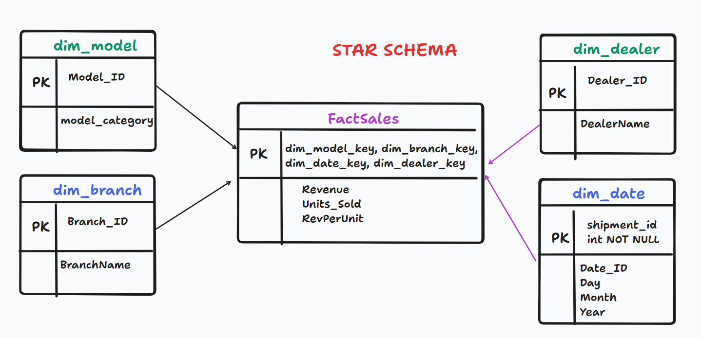

# Car Sales Data Engineering Project

## Overview
This project implements a modern data engineering pipeline for processing and analyzing car sales data using Microsoft Azure cloud services. The solution provides end-to-end data processing capabilities from ingestion to serving, following the medallion architecture pattern.

## Key Features

🔍 **Database Setup**
- Establishing a robust database structure is crucial for effective data management and query performance
- A well-prepared database ensures smooth data ingestion and transformation

🔗 **Resource Integration**
- Utilizing Azure Data Factory and Data Lake enables comprehensive data engineering workflows
- Allows for structured data processing and storage across varied formats

📅 **Efficient Incremental Loading**
- Incremental data loading enhances performance by reducing the volume of data processed in each load
- Ensures timely updates to the destination database

🏗️ **Star Schema Design**
- Implementing a star schema organizes data in a way that improves query performance and analytics
- Facilitates faster insights from large datasets

⏳ **Handling Slowly Changing Dimensions**
- Managing changes in data attributes is essential for maintaining data accuracy over time
- Particularly important in environments where data evolves frequently

⚙️ **Parameterized Pipeline**
- A parameterized approach allows for greater flexibility in deploying data pipelines to production
- Makes it easier to adapt to changing business requirements

## Architecture

### Technology Stack
- **Azure Data Factory**: Data orchestration and ingestion
- **Azure Databricks**: Data processing and transformation
- **Azure Data Lake Gen2**: Data storage
- **Azure SQL Database**: Operational data store
- **Unity Catalog**: Data governance and management

## Data Pipeline

### Data Flow
1. **Data Ingestion** (Azure Data Factory)
   - Source data ingestion from multiple formats (SQL, CSV)
   - Dynamic ETL pipeline creation
   - Incremental data loading support

2. **Data Processing** (Azure Databricks)
   - **Bronze Layer**: Raw data in Parquet format
   - **Silver Layer**: Transformed and cleaned data [One big table]
   - **Gold Layer**: Business-ready data in STAR schema
   - Delta Lake implementation for ACID compliance

3. **Data Serving**
   - Fact and Dimension tables
   - Incremental updates (30-day and 7-day windows)
   - PySpark transformations

## Infrastructure Setup

### Resource Configuration
1. **Resource Group**: `data_eng_project`
2. **Storage Account**: `<dataengproject>`
   - Containers:
     - `bronze`: Raw data storage
     - `silver`: Processed/Transformed data
     - `gold`: Business-ready Serving data

3. **Azure Data Factory**: `<azdatafactory_name>`
   - Pipelines:
     - `source_prep_pipeline`: Initial data loading
     - `incremental_data_pipeline`: Incremental updates
   - Activities:
     - `CopyGitData`: Source to destination copy
     - `Copy_Incremental_data`: Incremental data processing

4. **Azure SQL Database**: `<DB_name>`
   - Server: `<server_name>`

5. **Azure Databricks**: `<databricks_name>`
   - Managed Resource Group: `<resource_group_name>`
   - Unity Metastore Path: `<metastore_name>@<datalake_name>.dfs.core.windows.net/`
   - Connector: `<connector_name>`

## Dataset Details
- Source File: `<source_file>`
- Primary Keys: `<primary_keys>`

## Getting Started
1. Ensure access to [Azure Portal](https://portal.azure.com/)
2. Configure resource permissions and access controls
3. Set up linked services in Azure Data Factory
4. Configure Unity Catalog in Databricks workspace [Azure Databricks](https://accounts.azuredatabricks.net/)

## Some Screenshots:

