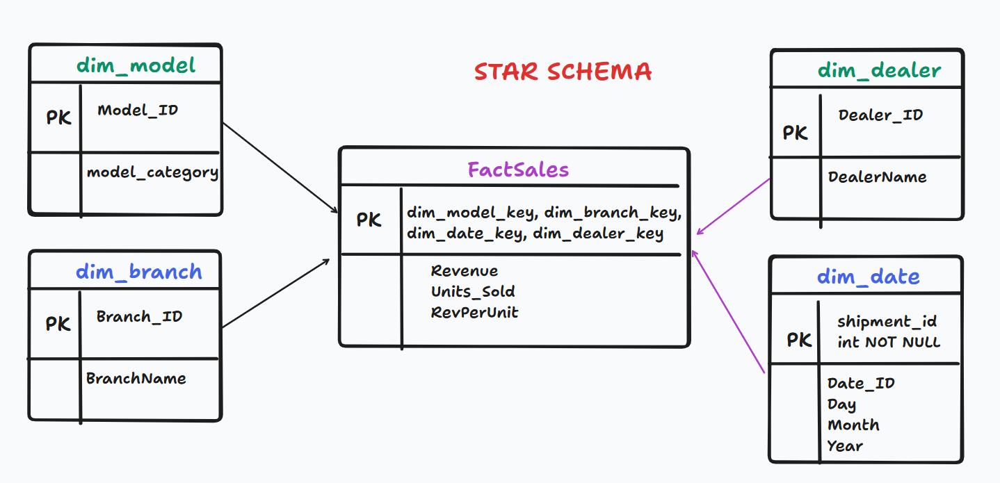
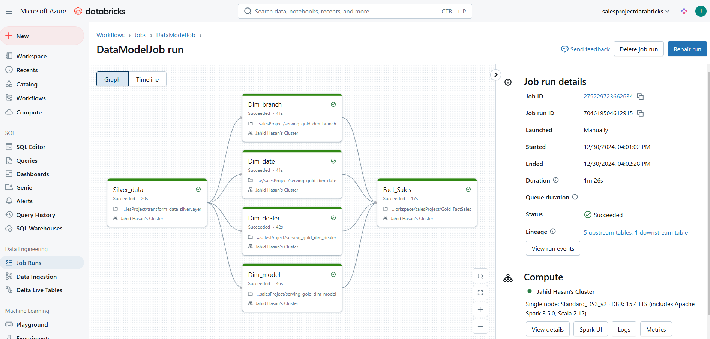
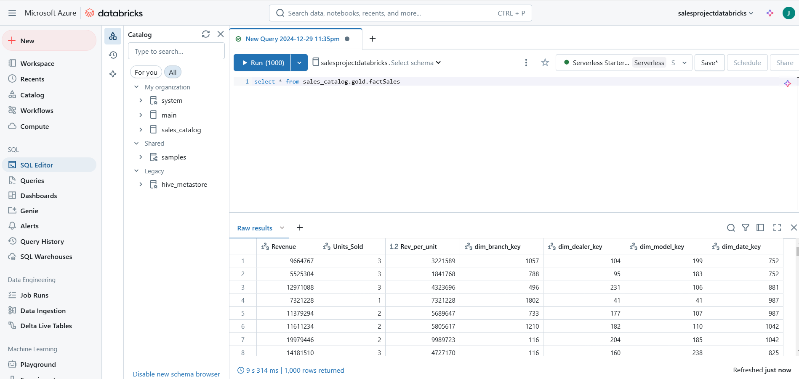

# Complete Data Engineering

## Practice Topics:
- Dimensional Data Modeling
- Fact Data Modeling
- Apache Spark
- Analytical Patterns
- Flink and Kafka Pipelines
- Pyspark
- KPIs & Exp
- Data Quality Patterns Analysis
- Data Visualization

# Project_Factory [Link](https://github.com/jahidhasanlinix/DataEngineering/tree/main/Project_Factory)
- Complete project done on Azure Data Factory, Data Lake Gen2, SQL, Pyspark, etc.
- Some Screenshot:

